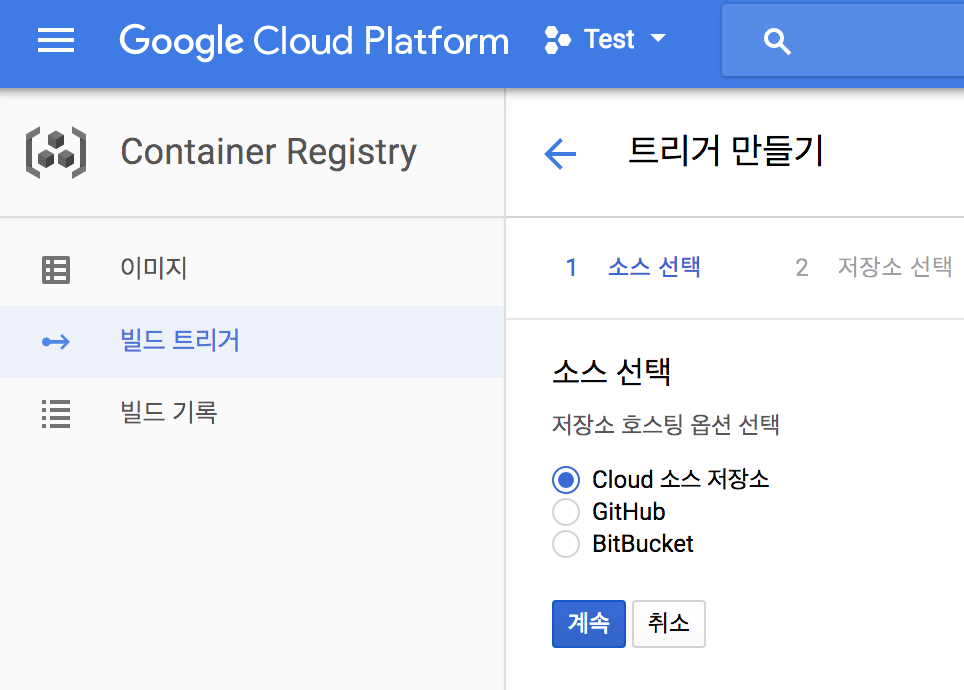
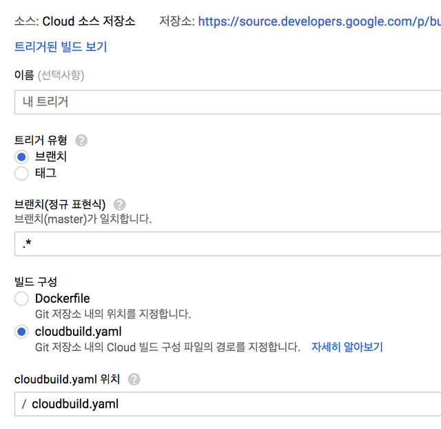

# Google Cloud Porject

## 개요.

프로젝트를 만들면, 해당 프로젝트용 Git서버가 생김. 서버에 Push가 될때 자동적으로 빌드하고 배포하게 할 수 있음. -> 커밋시 자동 배포 환경 완성.

## 프로젝트 만들기

## 저장소에 커밋하기

인증절차가 필요함.

그 외로는 Clone 등의 작업만 하면 됨.

간단.

## 기본파일 만들기

[ app.yaml ] (환경에 따라 다름.)

```
runtime: python27
api_version: 1
threadsafe: yes

handlers:
- url: /set-webhook
  login: admin
  script: main.app
- url: .*
  script: main.app

libraries:
- name: webapp2
  version: 2.5.2
```

App Engine 을 설정하는 파일이다. 자세한 설명은 - https://cloud.google.com/appengine/docs/standard/php/config/appref

[ cloudbuild.yaml ]

```
steps:
- name: 'gcr.io/cloud-builders/gcloud'
  args:
  - app
  - deploy
```

트리거가 해석하여 동작할 파일이다. 저 부분이 조금 고생했는데, steps는 트리거가 저 스텝대로 동작을 한다고 이해하면 된다. 좀더 자세한 설명은 다음 링크에 - https://cloud.google.com/container-builder/docs/create-custom-build-steps

## 빌드트리거 생성하기

빌드 트리거에게 IAM권한 설정 필요. (AppEngin 배포자 권한 필요)

Google APIs Explorer 필요

