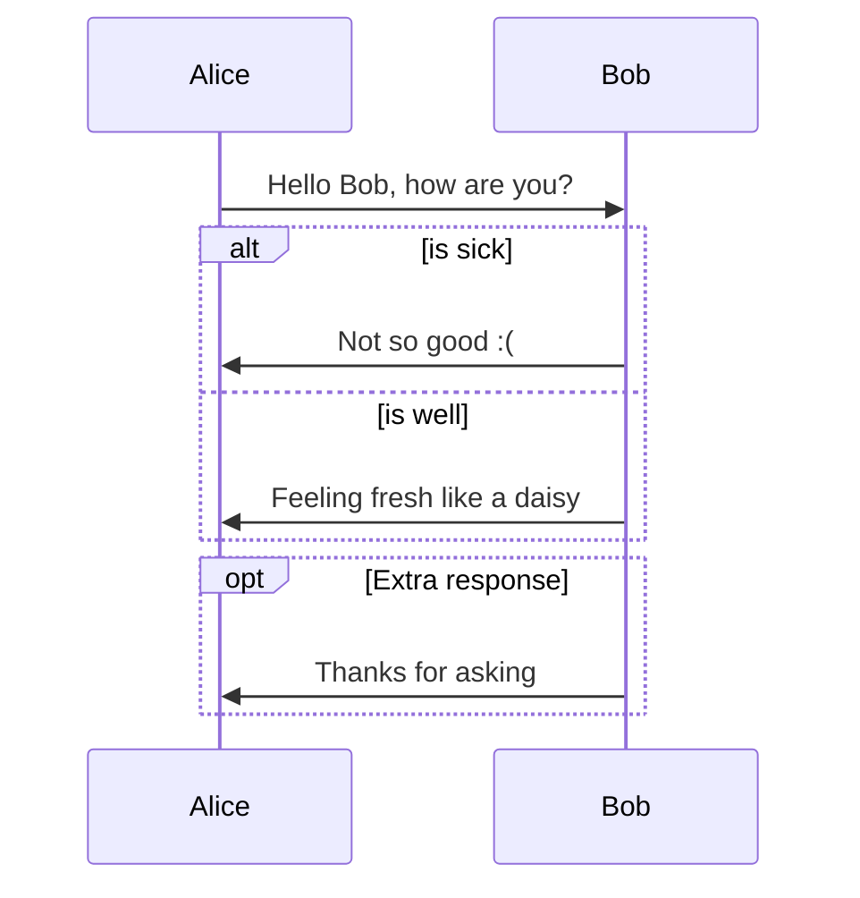
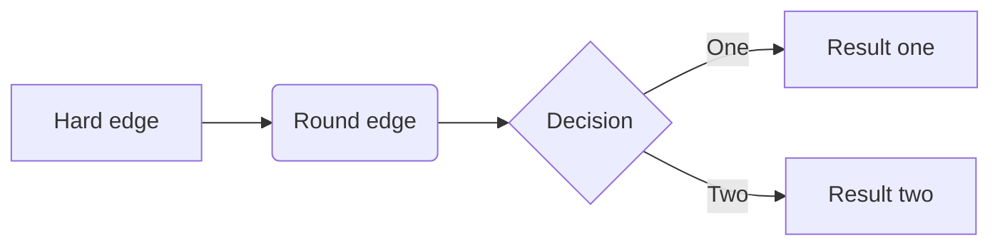
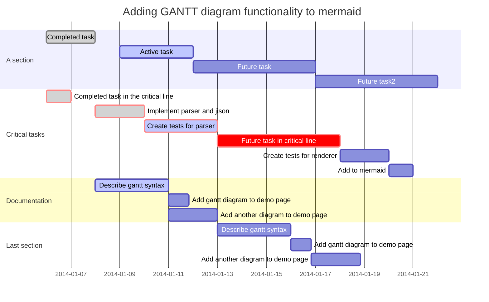

# 플로우 차트 작성하기 예제

## Sequence

It is powered by [js-sequence](https://bramp.github.io/js-sequence-diagrams/), which would turn following code block into rendered diagrams:

```sequence
Alice->Bob: Hello Bob, how are you?
Note right of Bob: Bob thinks
Bob-->Alice: I am good thanks!
```


## Flowchart

It is powered by [flowchart.js](http://flowchart.js.org/), which would turn following code block into rendered diagrams:

```flow
st=>start: Start:>http://www.google.com[blank]
e=>end:>http://www.google.com
op1=>operation: My Operation
sub1=>subroutine: My Subroutine
cond=>condition: Yes
or No?:>http://www.google.com
io=>inputoutput: catch something...
para=>parallel: parallel tasks

st->op1->cond
cond(yes)->io->e
cond(no)->para
para(path1, bottom)->sub1(right)->op1
para(path2, top)->op1
```


## Mermaid

Typora also has integration with [mermaid](https://knsv.github.io/mermaid/#mermaid), which supports sequence, flowchart and Gantt.

### Sequence

see [this doc](https://knsv.github.io/mermaid/#sequence-diagrams)



### Flowchart

see [this doc](https://knsv.github.io/mermaid/#flowcharts-basic-syntax)



### Gantt

see [this doc](https://knsv.github.io/mermaid/#gant-diagrams)



# 작성 연습

## Flowchart

```flow
st=>start: AZone Start
e=>end
op=>operation: Your Operation
op_move_load=>operation: move_Load
cond=>condition: Yes or No?
cond_Wait_TurnTable=>condition: start signal


st->cond_Wait_TurnTable
cond_Wait_TurnTable(yes)->op_move_load
cond_Wait_TurnTable(no)->cond_Wait_TurnTable
op_move_load->op->cond
cond(yes)->e
cond(no)->cond
```